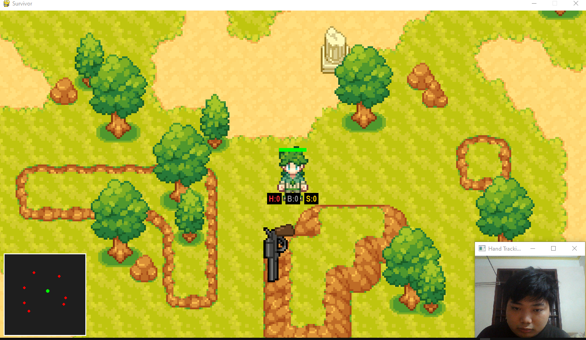
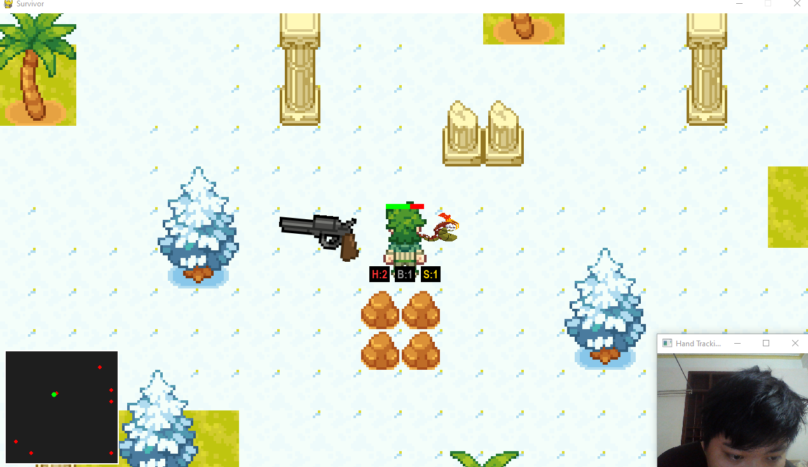
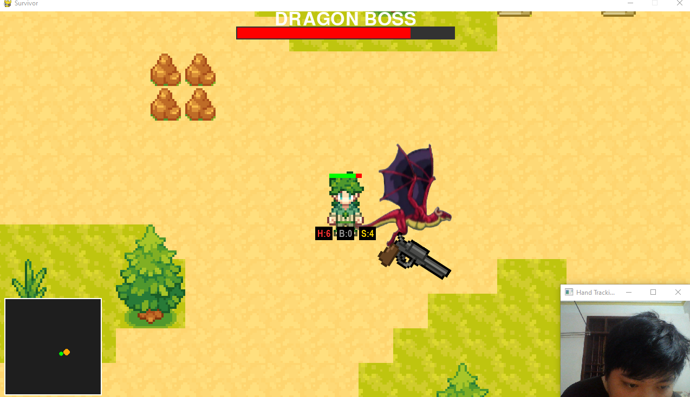

<h2 align="center">
    <a href="https://dainam.edu.vn/vi/khoa-cong-nghe-thong-tin">
    🎓 Faculty of Information Technology (DaiNam University)
    </a>
</h2>
<h2 align="center">
   Survival Contract
</h2>

    

        
        
        
    

---

## 1. Giới thiệu Về Game
**Survival Contract** là một dự án game nhập vai hành động được phát triển theo phong cách "Vibe Coding". Dự án tập trung nghiên cứu và ứng dụng thư viện **MediaPipe Hands** để tạo ra trải nghiệm điều khiển nhân vật bằng cử chỉ tay (Hand Gestures) thay cho bàn phím truyền thống.

Đây là sản phẩm nghiên cứu trong môn **Công nghệ xử lý ảnh**, hướng tới việc tối ưu hóa tương tác người-máy (HCI) trong môi trường game thực tế.

---

## 2. Bối cảnh game
Năm 2098, thế giới bị kiểm soát bởi các tập đoàn tài chính khổng lồ. Nợ không còn tính bằng tiền — nợ đổi bằng mạng sống. 

Những người vỡ nợ bị ép ký vào **“Hợp Đồng Sinh Tồn”** (Survival Contract) và bị ném xuống những khu vực bị bỏ hoang nhiễm phóng xạ để khai thác tài nguyên cho tập đoàn. Bạn vào vai **Kaito**, một kẻ dính nợ cờ bạc, phải chiến đấu với quái vật đột biến và những thực thể cổ xưa để xóa nợ hoặc vĩnh viễn nằm lại nơi hầm mỏ tối tăm.

---

## 3. Demo

    
    
<i><b>Hình 1:</b> Map 1 - Khởi đầu cuộc hành trình tại khu rừng</i>

     
    
    
<i><b>Hình 2:</b> Map 2 - Tiến sâu vào bên trong</i>

     
    
    
<i><b>Hình 3:</b> Map 3 - Đại chiến Boss Rồng </i>

---

## 4. Gameplay
* **Điều khiển không chạm:** Sử dụng camera để theo dõi bàn tay. Di chuyển tay để điều khiển hướng chạy của Kaito.
* **Hệ thống chiến đấu:** * Tay phải: Điều khiển hướng và bắn súng tự động.
    * Tay trái: Sử dụng các kỹ năng đặc biệt thông qua số lượng ngón tay giơ lên.
* **Hệ thống màn chơi:** Trải qua 3 Map từ khu rừng phóng xạ đến đấu trường Boss Rồng.
* **Thanh máu Boss:** Theo dõi sinh mệnh của Boss ngay phía trên màn hình ở Map cuối.

---

## 5. Các loại vật phẩm & Cử chỉ
| Cử chỉ (Tay trái) | Vật phẩm | Chức năng |
|:---:|:---:|:---|
| ✌️ (2 ngón) | **Health Kit** | Hồi 25% máu ngay lập tức cho nhân vật. |
| 🤟 (3 ngón) | **Nuclear Bomb** | Kích nổ diện rộng, gây sát thương cực lớn cho kẻ địch xung quanh. |
| 🖐️ (4 ngón) | **Stun Grenade** | Làm cho toàn bộ quái vật trên màn hình đứng im trong thời gian ngắn. |

---

## 6. Công nghệ sử dụng

---

## 7. Cài đặt

- Clone project
git clone [https://github.com/MinnKaa/Survival-Contract.git]

- Cài thư viện cần thiết
pip install pygame pytmx mediapipe opencv-python

- Chạy game
python code/main.py

---
## 8. Thành viên

 1.Vũ Đức Minh - CNTT16_02
 
 2.Đỗ Quốc VIệt - CNTT16_02

---
